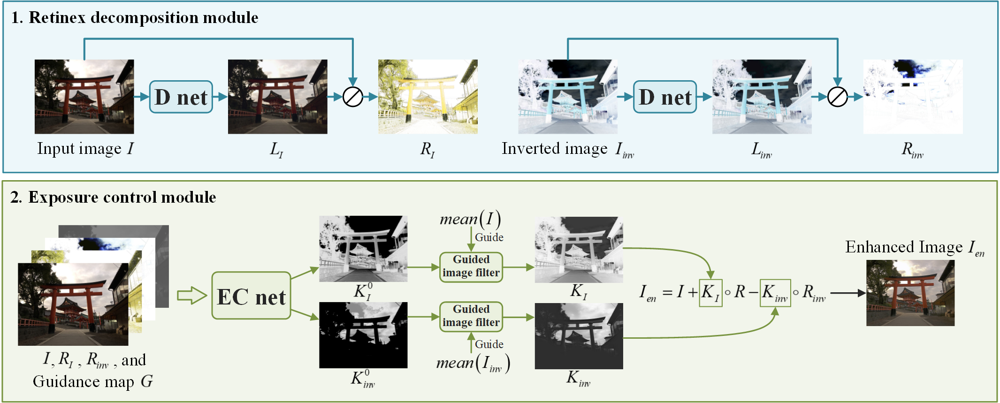

# Unsupervised Retinex Exposure Control: A Novel Approach to Image Enhancement

Yunkun Yang, Libo Sun, Weipeng Shi, Wenhu Qin

Southeast University (SEU)

## Introduction

This repository is the code of the paper, "Unsupervised Retinex Exposure Control: A Novel Approach to Image Enhancement", https://doi.org/10.1049/ipr2.70077.

We propose a new approach that adopts unsupervised learning and achieves image exposure control based on the Retinex theory. We can control the exposure distribution of the image using a manually adjusted guidance map, as illustrated in the figure below (the guidance map is not shown).

In addition to manually adjusting the guidance map to control image exposure, we also provide an adaptive method for generating the guidance map to simplify the process. For more details, please refer to the appendix of our paper. We also provide extensive testing results in our paper and appendix, which can be viewed via the following link (https://doi.org/10.1049/ipr2.70077).

## Requirements of codes

The enviroment we use in UREC is listed below: 

    Python 3.11.0
    torch 2.1.0
    torchvision 0.16.0
    cuda 12.1
    numpy 1.23.5
    matplotlib 3.4.3
    opencv-python 4.7.0.72
    scikit-image 0.20.0
    scipy 1.10.1
    tqdm 4.65.0

## Test:

The weight files are put in dir ./weights

You can use the following command to test our model (path need be changed in codes):

    python test.py 

In the code, you can either manually generate the guidance map to control image exposure or use the simple adaptive guidance map generation method we provided. For details, please refer to the comments in code.

## Dataset

MSEC dataset (EED): https://github.com/mahmoudnafifi/.Exposure_Correction

SICE dataset: https://github.com/csjcai/SICE.

The most difficult image enhancement dataset (TM-DIED): https://www.flickr.com/photos/73847677@N02/albums/72157718844828948/.

VV dataset: https://drive.google.com/drive/folders/1lp6m5JE3kf3M66Dicbx5wSnvhxt90V4T.

## Contact

If you have any problem with the released code, please do not hesitate to contact me by email (yangyukun@seu.edu.cn).

## Cite

If you find the repository helpful in your resarch, please cite the following paper.

    @article{https://doi.org/10.1049/ipr2.70077
    title = {Unsupervised Retinex Exposure Control: A Novel Approach to Image Enhancement},
    author = {Yang, Yukun and Sun, Libo and Shi, Weipeng and Qin, Wenhu},
    journal = {IET Image Processing},
    volume = {19},
    number = {1},
    doi = {https://doi.org/10.1049/ipr2.70077},
    year = {2025}
    }